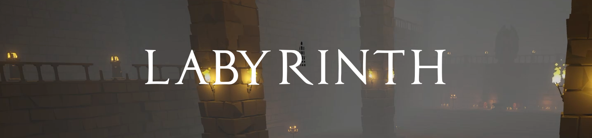
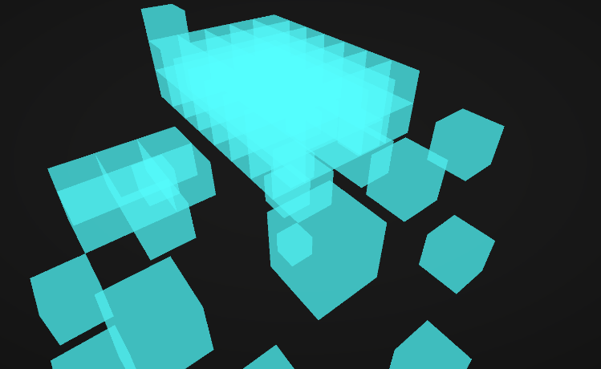
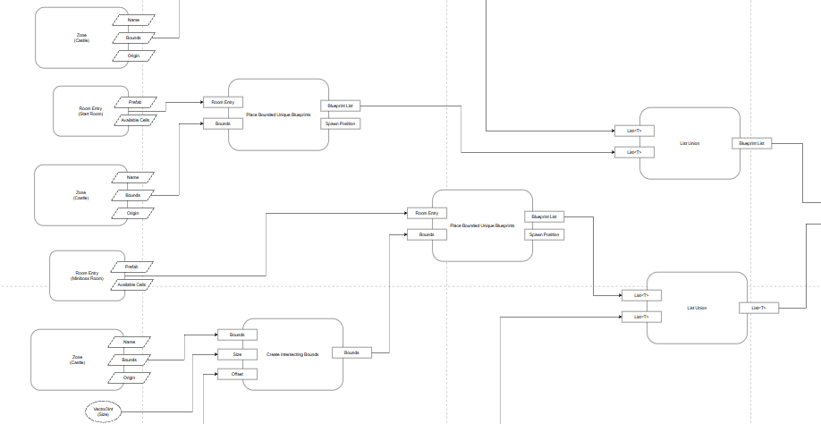
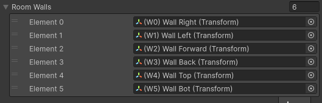
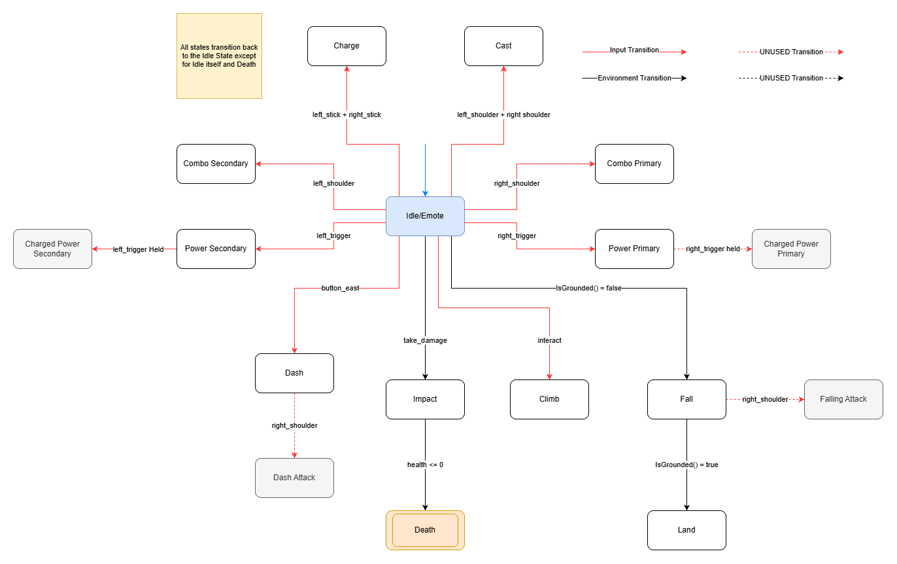

Try the demo out [here](https://madcolors-entertainment.itch.io/labyrinth-demo)!
## Overview
Highly adaptable procedural dungeon generation algorithm built in Unity/C# with the purpose of creating seamlessly connected, thematically distinct 3D areas without loading screens.

| Feature                                                                     | Description                                                                                                           | Version                                                               |
| --------------------------------------------------------------------------- | --------------------------------------------------------------------------------------------------------------------- | --------------------------------------------------------------------- |
| [Blueprints](##blueprints)                                                  | Parsible marks on a grid that can eventually be used to spawn rooms.                                                  |  |
| [Blueprint Operations](##blueprint-operations)                              | Instruction-set style units of execution that make the algorithm step-able.                                           |  |
| [Blueprint Graph](#blueprint-graph)                                         | Combines blueprint operations into a model that can create a unique map generation style.                             |  |
| [Zones](#zones)                                                             | Areas of the map that can house it's own rooms, rules, loot, etc.                                                     |  |
| [Unique Blueprint Placement](#unique-blueprint-placement)                   | Places necessary rooms in a bounded zone.                                                                             |  |
| [Divergent Blueprint Placement](#divergent-blueprint-placement)             | Randomly places blueprints of varying size around the map for more variation.                                         |  |
| [Delaunay Triangulation (Bowyer Watson Algorithm)](#delaunay-triangulation) | Creates a mesh/graph from a list of blueprints that can later be used to connect them with A*.                        |  |
| [Pathfinding](##pathfinding)                                                | Connecting corridors with four with A* using four swappable heuristics to effect path style.                          |  |
| [The Drunkard's Walk](##the-drunkards-walk)                                 | Places blueprints randomly in a connected path. Can diverge off other paths and has a recursive safety check feature. |  |
| [Room Parsing](#room-parsing)                                               | Blueprints are parsed and rooms are chosen to spawn based on their patterns.                                          |  |
| [Player State Machine](##player-state-machine)                              | An NFA is used to transition the player's states. Also made in a way to support a complex ability system.             |  |
| [Command Line Interface](##command-line-interface)                          | Custom CLI with global commands to help debugging.                                                                    |  |


## Backstory
I began building this algorithm back in 2023 for a club at my university. My peers and I were tasked with procedurally generating a 3D dungeon for an FPS we were making. It goes without saying that, between coursework and other obligations, a single semester wasn't enough time to finish a game of that scale. The game itself never came together, but it was enough to hook me on procedural generation. I picked the algorithm back up and kept developing it in 2024.

The procedural generation was simple at first, relying on an algorithm called The Drunkard's Walk that spawned rooms in random directions from the previous one. I later added Delaunay triangulation, A\*, and Prim's algorithm to the pipeline.

Most of the algorithms the Labyrinth uses today are well known in the proc-gen community, but there's one feature I can genuinely call my own. Back in the club days, I had little formal knowledge of how procedural generation actually worked, so in a way, I had to get creative. Drawing on what I knew about Drunkard's Walk and rule tiles, I came up with a feature I call "Blueprints", individual, single-celled components on a grid that combine to form an entire map.

I've always admired how games like _The Binding of Isaac_, _Enter the Gungeon_, and _Wizard of Legend_ generate their maps, but I equally admired the intricate, deliberate level design of games like _Zelda_ and _Dark Souls_. Was there a way to randomize dungeon layouts while still producing levels that felt hand-crafted and made sense? Is it possible to link these levels together seamlessly so that different themed areas didn't need to be loaded in a different scene? That's the problem I set out to solve.

The algorithm was made in Unity 3D but can be rewritten to work in any game engine.
## Blueprints
Blueprints are the backbone of the algorithm. They must exist in order for any rooms to generate. Blueprints are simply single-celled marks on a grid that tell the algorithm "a room can eventually spawn here". When the blueprints are done generating a second pass then parses the blueprints and generates rooms based on a set of rules. Think of how Rule-Tiles work in game engines.

```
public class Blueprint
{
    public readonly string CellID;
    public readonly Vector3Int Position;    // Position of blueprint coords on grid
    public bool Available { get; set; }       // Prevents/allows parsing algorithm to use blueprint
    public bool[] EntryPointFlags { get; set; }

    // Constructor
    public Blueprint(Vector3Int postion, string cellID = "Blueprint")
    {
        Claimed = true;
        CellID = cellID;
        Position = postion;
        EntryPointFlags = new bool[6];       // A flag to mark which entrances should be open for a room
    }
}
```
To prevent blueprints from spawning on top of other blueprints a Dictionary is used. A C# dictionary has O(1) lookup time, cannot contain duplicates, and can allocate space dynamically. To prevent rooms from spawning on top of each other blueprints house a flag called `Available` that tells the room parser whether or not to include the blueprint in it's check. Finally, `EntryPointFlags` tell the room what doorways it needs to open. These flags are determined during the blueprint pass of the algorithm.
## Blueprint Operations
As the project started getting larger it was essential to have a decent debugging system in place. Procedural generation is already hard to debug as it is, many errors are semantic and cannot be traced through code directly. At the time, the procedural generator executed all of its code in one go, but I wanted a way to step through each process individually, something akin to setting breakpoints in code. This is when I had the idea of applying concepts from assembly and instruction set architecture to my algorithm. Little did I know that building this debugger would end up making my procedural generator more dynamic and controllable than ever before.

To accomplish this, I needed to split each of the algorithm's processes into individual, executable components I call "Blueprint Operations." Each operation holds both input and output data, similar to registers in an assembly language. Operations are initialized and placed into a queue, then executed one by one.
```
public abstract class BlueprintOperation
{
	// DataID for is used strictly for debugging purposes.
	public string OperationID { get; protected set; }

	// Ports are the auguments and return values of operations.
	public List<string> InputPorts { get; protected set; }
	public List<string> OutputPorts { get; protected set; }

	protected MapGenerationContext _context;

	public BlueprintOperation(MapGenerationContext context)
	{
		InputPorts = new List<string>();
		OutputPorts = new List<string>();

		_context = context;
	}

	...
}

...

public sealed class MapGenerationContext
{
	// Quick random access blueprint container; stores all blueprints generated in map
	private static Dictionary<Vector3Int, Blueprint> _blueprintDictionary;
	public static Dictionary<Vector3Int, Blueprint> BlueprintDictionary => _blueprintDictionary;

	...
}
```
#### Map Generation Context
Just like in assembly, the outputs of some operations need to be stored in memory so other operations can use them later. The map generation's `context` holds both the instruction/operation execution order and the data used in those operations.
```
public sealed class MapGenerationContext
{
	...

    public int OperationIDCounter { get; private set; } = 10000;
    public int MemoryIDCounter { get; private set; } = 20000;

	// Stores blueprint operations to be executed later
    public LinkedList<BlueprintOperation> OperationQueue { get; private set; }

	// Stores outputs from blueprint operations
    private Dictionary<string, object> _dataCache;

    public MapGenerationContext()
    {
        _dataCache = new();
        _blueprintDictionary = new();
        OperationQueue = new();
    }

    public BlueprintOperation OperationQueuePeek()
    {
        return OperationQueue?.First.Value;
    }

    public void OperationQueueEnqueue(BlueprintOperation op)
    {
        OperationQueue?.AddLast(op);
    }

    public void OperationQueueAddFront(BlueprintOperation op)
    {
        OperationQueue?.AddFirst(op);
    }

    public BlueprintOperation OperationQueueDequeue()
    {
        // Check to see if queue has atleast one operation stored
        if (OperationQueue?.First is null)
            return null;

        BlueprintOperation op = OperationQueue?.First.Value;
        OperationQueue?.RemoveFirst();
        return op;
    }
    
    // Get data
    public bool TryGet<T>(string memoryID, out T value)
    {
        if (_dataCache is null)
        {
            value = default;
            return false;
        }

        if (_dataCache.TryGetValue(memoryID, out object obj) && obj is T castValue)
        {
            value = castValue;
            return true;
        }

        value = default;
        return false;
    }

	// Store data
    public void Malloc(string memoryID, object value)
    {
        if (_dataCache is null)
            return;

        _dataCache[memoryID] = value;
    }

	// Check for data
    public bool Contains(string memoryID)
    {
        if (_dataCache is null)
            return false;

        return _dataCache.ContainsKey(memoryID);
    }

	// Remove data
    public void Remove(string memoryID)
    {
        if (_dataCache is null)
            return;

        if (_dataCache.ContainsKey(memoryID))
            _dataCache.Remove(memoryID);
    }

    public int ConsumeOperationID()
    {
        return OperationIDCounter++;
    }

    public int ConsumeMemoryID()
    {
        return MemoryIDCounter++;
    }
    
    ...
}
```
## Blueprint Graph
Around the time I was implementing this feature, I started learning a bit of Unreal Engine and was impressed by its visual scripting graph, conveniently called "Blueprints." Conveniently I was able to draw a few parallels between Unreal's Blueprints and mine. Each operation is essentially a node with inputs, outputs, and an execution order. They can be executed in any order and support a wide range of use cases. For example, this implementation lets me require a key from a separate path to unlock a door to a new one, or pathfind to any given room using any heuristic of my choosing. This is great for hidden secrets, connecting zones, and countless other unique cases.

The graph contains many intermediary operations that are also useful to the developer. Set operations like union, intersection, and difference can be applied to blueprints for interesting generations. There are random access operations for variation, and even branch and jump operations for loops.

Right now, all nodes are hardcoded into a controller, though I'd like to move to Unity's graphing toolkit in a future implementation. Below is the controller used to both store and execute operations. Operations can be stepped through by a specified `stepLength`, given via the `Advance()` function.
```
public class MapGenerationController
{
	private void LoadOperations()
	{
		// Hardcoded operations listed in their order of execution. Loaded into context to be executed later.
		
		...
	}

	private void ConsumeStep()
	{	
		if (_runToEnd)
			return;
		
		if (_stepBudget > 0)
			_stepBudget--;
	}
	
	public void Advance(int stepLength)
	{	
		if (stepLength <= 0)
			return;
		
		_stepBudget += stepLength;
		_runToEnd = false;
	}
	
	public void AdvanceAll()
	{
		if (!IsGenerating)
			return;
		
		_runToEnd = true;
	}
	
	private IEnumerator ExecuteOperations()
	{
		// Execute operations and generate blueprints
		while (_context.OperationQueue.Count > 0)
		{
			// Halt the execution of operations
			while (!_runToEnd && _stepBudget <= 0)
				yield return null;
			
			ConsumeStep();
		
			// Dequeue the current opration
			BlueprintOperation operation = _context.OperationQueueDequeue();
			if (operation == null)
				throw new ArgumentNullException(nameof(operation));
		
			// Execute Operation
			bool result = operation.Execute();
		
			// Operation failed to execute; stop running coroutine
			if (!result)
			{
				GenerationFailed();
				yield break;
			}
		}
	}
	
	...
}
```
## Zones
One of the most important problems I set out to solve was a way to generate themed areas and connect them together in a seamless fashion. As stated in the intro, alongside rogue-likes I'm also a huge fan of RPGs that can transport the player to different areas from multiple entry points on the map. The concept of "Zones" helped me accomplish this.

Zones connect to one another through intermediary zones I call "Connection Zones." These zones simply intersect their bounds with others and connect them via their own blueprint operations.

As of now, Zones are purely containers that house unique rooms, branches, and bounds that contain their blueprints. A controller still determines zone generation, though in a future update, Zones will be able to house their own operations and blueprint graph for unique generation rules.

## Unique Blueprint Placement
Unique rooms are rooms determined by their zone before runtime; the blueprints generated in place of these rooms _are not_ to be included later in the room parsing procedure. These are most likely boss rooms, mini-boss rooms, large rooms, or any rooms whose blueprint shape would be difficult or impossible to parse later.

These rooms can either be fixed (placed in a set position) or bounded (placed randomly within set bounds). Both cases have their respective blueprint operations. The blueprints generated from this operation can later be used as points for the Delaunay and A\* operations.
## Divergent Blueprint Placement
Some zones may have few unique rooms, which means a small set of points for pathfinding. The resulting generation would be very simple and boring. To make the generation a bit more windy and organic, we place what I call "Divergent Rooms" to add more points to the pathfinding graph.

Divergent rooms are a set number of blueprints randomly spawned within a zone. These blueprints can have varied dimensions, described as an input to the operation. The blueprints generated from this operation can later be used as points by the Delaunay and A\* operations.
## Delaunay Triangulation
Delaunay Triangulation takes a set of defined points and creates a triangle mesh that can later be used as a graph for pathfinding. In 2D it's fairly simple, but in 3D it gets more complicated, instead of triangles we must use tetrahedra and calculate the volume of those tetrahedra using the determinant function.

Delaunay uses a set of blueprint positions as points and creates edges connecting them. It also helps prevent the generation of a dungeon with too many long and unnecessary paths between rooms.

#### Handling Coplanar Tetrahedra
A major problem I faced was dealing with degenerate tetrahedra, which can occur when all four points are coplanar. I needed to ensure that at least one blueprint point used in a tetrahedron exists on a different floor than the other three, to prevent this from happening. When a zone is completely flat (one floor), I can just use 2D Delaunay to connect the blueprints instead.

#### Greedy Algorithms
Delaunay ensures every point in the resultant graph is connected, which means no room is left out. However, this can still result in too many edges, leading to an excess of branches and rooms. To manage this, I use a greedy algorithm, Prim's Algorithm, to find the MST (minimum spanning tree) in the graph. From there, we can randomly select other edges in the graph if we want some loops in our dungeon.
## Pathfinding
Many pathfinding algorithms exist that could help connect blueprints together, but none are as fast and versatile as A\*. Using a pathfinding operation, I can either connect two blueprints directly or pass in a graph and connect all of its nodes. A\* returns all the positions needed to connect the blueprints, and from there I simply spawn new blueprints in their place.
#### Heuristic Functions
A cost/heuristic function tells A\* how to path toward each blueprint. The heuristic can make the path curvy, straight, or zig-zagged. There are endless possibilities for what the cost function can be, but as of now I use four well-known functions:

1. **Euclidean:** creates a fairly straight path to the target.
	
$$D(x, y) = \sqrt{((x_2 - x_1)^2 + (y_2 - y_1)^2 + (z_2 - z_1)^2)}$$

2. **Manhattan:** causes the path to stay parallel to the x, y, and z axes.
	
$$D(x, y) = | x_2 - x_1 | + | y_2 - y_1 | + | z_2 - z_1 |$$
	
3. **Chebyshev:** causes the path to zig-zag and staircase.
	
$$D(x, y) = max( | x_2 - x_1 |, | y_2 - y_1 |, | z_2 - z_1 | )$$

4. **Dijkstra:** guaranteed optimal path; cheapest route.
	
$$D(x, y) = 0$$

## The Drunkard's Walk
This was the first algorithm that gave birth to the Labyrinth. Simply put, a blueprint is placed randomly in one of six directions from a point in space. This continues until a pathway is generated with the desired number of rooms. Seems simple enough at first, but I ran into a problem: what if the point is already surrounded by other blueprints? Should the algorithm just stop generating and cut its losses?
#### Backtracking
The solution was backtracking. When a conflict occurs, a recursive algorithm backtracks to a previously placed blueprint and attempts to generate a new one in its place.
```
private bool BlueprintDrunkardWalkRecursive(BoundsInt bounds, Blueprint previousBlueprint)
{
	// Amount of desired blueprints placed; stop condition
    if (path.BlueprintCount() >= DesiredPathLength)
        return true;

    // Attempt to place a new blueprint
    Blueprint newBlueprint = PlaceBlueprintInRandomDirection(bounds, previousBlueprint);

	// New blueprint was placed -> place next blueprint
    if (newBlueprint != null)
    {
        bool placed = BlueprintDrunkardWalkRecursive(bounds, newBlueprint);

		// next blueprint could not be placed? Continuation of path failed -> try prev blueprint again
        if (!placed)
            return BlueprintDrunkardWalkRecursive(bounds, previousBlueprint); // Backtrack
        else
            return true;
    }
    return false;    // No blueprint could be placed; not enough valid space
}
```
Drunkard's Walk is still used today for branches that can lead to rewards, trials, and secrets.
## Room Parsing
The final pass of the algorithm parses all available blueprints and determines what prefab rooms can be generated from them. The parsing rules are simple for now, and only four room shapes can currently be generated: "Small" rooms take up a (1, 1, 1) space, "Long" rooms take up a (2, 1, 1) space, "Tall" rooms take up a (1, 2, 1) space, and "Big" rooms take up a (2, 1, 2) space. For a future update, I'd like to rework the parsing algorithm to generate rooms of any shape using recursion and rules.
#### Room Entry Points
As stated earlier, the Blueprint class contains an array called `EntryPointFlags`. This communicates which walls need entranceways connecting to adjacent rooms. The parser detects which face of the blueprint corresponds to which wall of the room by matching the array index.

- Index 0 — Right Face (1, 0, 0)
- Index 1 — Left Face (-1, 0, 0)
- Index 2 — Forward Face (0, 0, 1)
- Index 3 — Back Face (0, 0, -1)
- Index 4 — Top Face (0, 1, 0)
- Index 5 — Bottom Face (0, -1, 0)

#### Room Rotation
Rooms can be made to rotate if suitable blueprints are found in different orientations. For instance, if two blueprints are found occupying a (1, 1, 2) space, we know a "Long" room can fit there, although how can we generate them when they are oriented (2, 1, 1) by default? Rotation handles this case by rotating not only the room prefab, but also the entry point array of each Blueprint associated with the room, so the entrances still correctly line up with adjacent rooms.
```
private bool[] HandleRotation(bool[] entrypointArray, Vector3 rotation)
{
	// If no rotation return original array
    if (rotation == Vector3.zero)
        return entrypointArray;

    // A 90-degree yaw swaps which physical wall each blueprint face flag now points at (e.g. the wall that used to face +Z now faces +X), so the flags have to be permuted to match and not just copied
    bool[] rotatedArray = new bool[entrypointArray.Length];
    if (rotation.y == 90)      // If 90 degree rotation shift down
    {
        rotatedArray[0] = entrypointFlagArray[2]; // Positive X to Negative Z
        rotatedArray[1] = entrypointFlagArray[3]; // Negative X to Positive z
        rotatedArray[2] = entrypointFlagArray[1]; // Positive Z direction the same
        rotatedArray[3] = entrypointFlagArray[0]; // Negative Z direction the same
        rotatedArray[4] = entrypointFlagArray[4]; // Positive Y to Positive X
        rotatedArray[5] = entrypointFlagArray[5]; // Negative Y to Negative X
    }
    
    return rotatedArray;
}
```
## Other Features
#### Player State Machine
Originally, before I became obsessed with the procedural generator, this project leaned more toward a game than a tech demo. The player could wield multiple weapons, each housing its own set of abilities, and also cycled through situational states like falling, climbing, and emoting. Without a formal state model, the player codebase would have devolved into an unmanageable tangle of flags and booleans so I turned to finite automata instead.

Using the principles from _Introduction to the Theory of Computation_ by Michael Sipser, I modeled the player as an NFA: a set of states **Q**, whose transitions are triggered by an input symbol from the alphabet **Σ**, or by an empty input. The rules break down as follows:
- **States (Q)** = { Idle, ComboPrimary, PowerPrimary, ComboSecondary, PowerSecondary, Charge, Cast, Fall, Land, Climb, Dash, DashAttack, Hit, Death, Emote }
- **Alphabet (Σ)** = { button_south, button_east, button_west, button_north, left_stick, right_stick, right_shoulder, left_shoulder, right_trigger, left_trigger, interact, take_damage, IsGrounded() = true, IsGrounded() = false, left_stick + right_stick, left_shoulder + right_shoulder, emote }
- **Start State (q0 ∈ Q)** = { Idle }
- **Final States (F ⊆ Q)** = { Death }



Each state in code is represented as a class. A new instance is created and held in the player's `currentState` variable. Every state implements a shared interface with three required functions:
```
public class SomePlayerState : PlayerState
{
    public SomePlayerState(PlayerStateMachine stateMachine) : base(stateMachine) { }

	// Enter is called on the first frame when the state is created.
    public override void Enter() { }

	// Tick is called on every frame of the stateMachine.
    public override void Tick(float deltaTime) { }

	// Exit is called right before the state is switched.
    public override void Exit() { }
}
```
- `Enter()` fires on the first frame the state becomes active, before any `Tick()` calls. It's best used for subscribing to events and setting up animations. 
- `Tick()` runs every frame the player remains in the state, handling whatever needs continuous updating.  
- `Exit()` runs on the state's final frame, right before the switch occurs — the next state won't begin executing until this finishes. It's the right place to unsubscribe from events and cancel any in-progress actions or animations.

This state machine kept the player controller predictable even as the ability list grew new states could be added without worrying about which combination of booleans might silently break another. In hindsight, that discipline ended up mattering more than I expected: once the procedural generator became the focus of the project, having a player controller that was already modular and easy to scale meant I could add more states an abilities in the future without worrying about changing source code.
#### Command Line Interface
As my project grew larger, having a solid debugging system in place became essential. Procedural generation is already hard to debug, many errors are semantic, meaning it can be difficult to trace through code alone. That's what sparked the idea of building a CLI.

Each command is an object of type `ConsoleCommand`, tied to a unique ID and a delegate. Commands are stored in a command registry - a dictionary keyed by command ID. The first string typed into the interface is parsed as the command name; everything after it is treated as that command's arguments.

By decoupling commands from the registry, I ensured they could be created from anywhere in the project, reducing dependencies, mitigating subscription errors, and keeping the system adaptable to future updates.
```
/// Class that holds the format and function of a command
public class ConsoleCommand
{
	private string _commandId;
	private string _commandDescription;
	private Action<string[]> _execute;

	public string CommandId { get { return _commandId; } }
	public string CommandDescription { get { return _commandDescription; } }
	public Action<string[]> Execute { get { return _execute; } }

	public ConsoleCommand(string commandId, string commandDescription, Action<string[]> execute)
	{
		_commandId = commandId;
		_commandDescription = commandDescription;
		_execute = execute;
	}
}

    public class ConsoleCommandRegistry
    {
        // List to hold all commands
        private Dictionary<string, ConsoleCommand> _commands = new();

        public void RegisterCommand(ConsoleCommand command)
        {
	        // Prevent duplicate command entries
            if (_commands.ContainsKey(command.CommandId.ToLower()))
                return;

            // Add command to registry
            _commands.Add(command.CommandId, command);
        }

	public void UnregisterCommand(string commandId)
	{
		// Prevent unregistering a command that doesn't exist
		if (!_commands.ContainsKey(commandId.ToLower()))
			return;
			
		// Remove command from registry
		_commands.Remove(commandId.ToLower());
	}

	public bool TryExecuteCommand(string input)
	{
		// Split the string into individual parts
		// This will help us determine the command arguments
		var splitString = input.Split(' ');

		if (splitString.Length == 0) 
			return false;

		// The command to execute itself
		string commandName = splitString[0].ToLower();
		
		// Command arguments
		string[] args = splitString.Length > 1 ? splitString[1..] : Array.Empty<string>();

		// Search command registry for command with the name specified
		if (_commands.TryGetValue(commandName, out var command))
		{
			try         // Attempt to execute the command
			{
				command.Execute.Invoke(args);
				return true;
			}
			catch (Exception e)     // Error executing command
			{
				Print($"Error executing command '{commandName}': {e.Message}.");
				return false;
			}
		}
		else    // Command keyword not recognized
		{
			Print($"Unknown command - {commandName}.");
		}

		return false;
	}
	
	...
}
```
With this setup, commands can be registered or unregistered from any script. Scripts can opt in/out of depending on the registry dynamically (e.g., register on enable, unregister on disable). Below is the typical format for registering a new command:
```
CommandRegistry.RegisterCommand(new ConsoleCommand(
    "category.command",                    // Command Name
    "A command that does something.",      // Command Description for 'help' command
    args =>    // Command delegate function
    {
		// Not needed if command takes no arguments
        if (args.Length < 2)
        {
            Print("No argument given, please enter true or false.");
            return;
        }
        
        // Extract arguments
        string arg0 = args[0];
        string arg1 = args[1];
        
	    // Execute command with input
	    ...  
       
    }));
```
## Upcoming Features
- Rework room parsing algorithm using recursive descent and grid rules
- Disconnect Unity dependencies and store code in DLL
- Use Unity's graphing toolkit to replace hardcoded blueprint graph
- Chunk loading
- Terrain generation using Perlin Noise
- Player map
## Sources
\[1] [Procedurally Generated Dungeons](https://vazgriz.com/119/procedurally-generated-dungeons/)

\[2] [Unity 2D Random Dungeon Generator for a Roguelike Video Game](https://www.udemy.com/share/101T4A3@iQWR-gXQBP0oQQ_dAg3i3d5jfOSPVi2ix_LewsRvxU0q2CbuDME-xcoRxJmfYLCYxw==/)

\[3] [D&D Dungeon Generation By Marvin van der Sluis](https://summit-2223-sem1.game-lab.nl/?p=49)

\[4] [Boyer-Watson Algorithm](https://en.wikipedia.org/wiki/Bowyer%E2%80%93Watson_algorithm)

\[5] [Amit's A* Pages](https://theory.stanford.edu/~amitp/GameProgramming/)

\[6] [(PRO) Enter the Gungeon](https://ondrejnepozitek.github.io/Edgar-Unity/docs/next/examples/enter-the-gungeon/)


